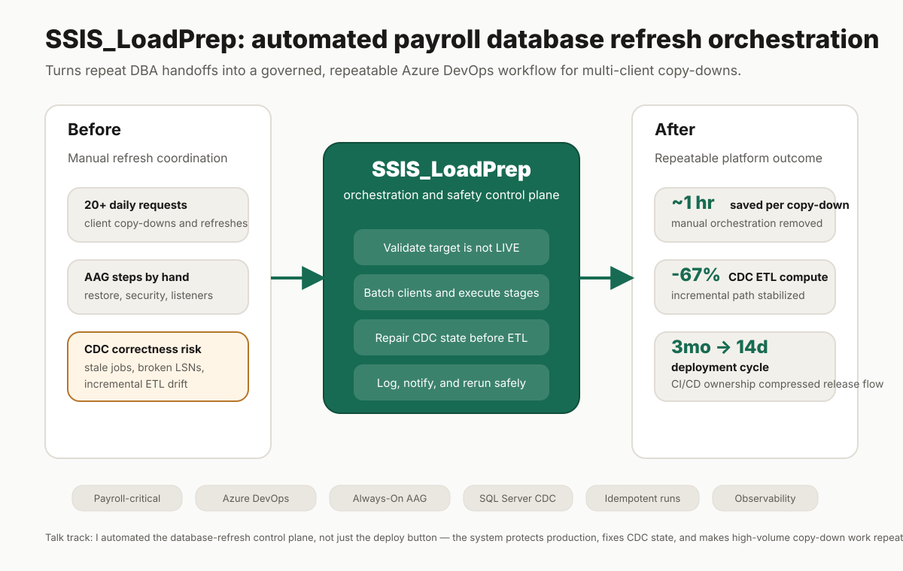
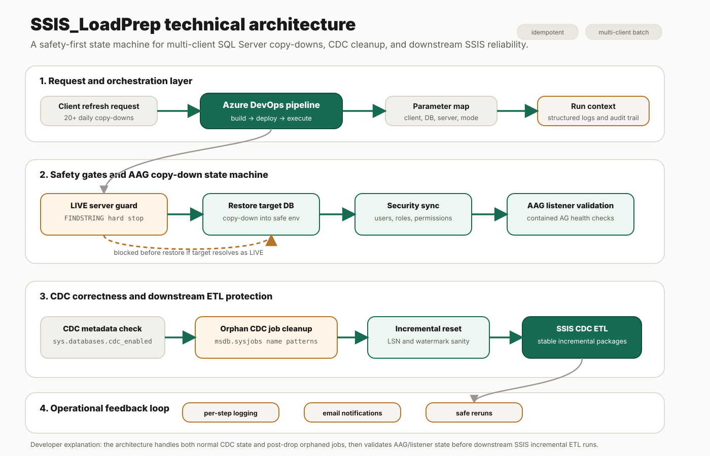

# SSIS_LoadPrep architecture walkthrough

This document supports the SSIS_LoadPrep portfolio card with two diagram levels: one for executives and IT leadership, and one for developers or architects who want to understand the control flow.

## Executive view

**Plain-English explanation:** SSIS_LoadPrep turns repeat payroll database refresh and copy-down requests into a controlled Azure DevOps workflow. Instead of coordinating restore, security, CDC, and Always-On Availability Group checks manually, the platform validates the target, executes the correct sequence, logs the result, and can be rerun safely.

**Business outcome talk track:**

- Handles 20+ daily client refresh or copy-down requests with deterministic execution.
- Saves roughly 1 hour of manual orchestration per AAG copy-down.
- Reduces CDC ETL compute by 67% by protecting the incremental path instead of relying on full reload behavior.
- Compresses release execution from a 3-month cycle to 14 days through CI/CD ownership.

## Technical architecture view

**Developer / IT architecture explanation:** SSIS_LoadPrep behaves like a database-refresh state machine. Azure DevOps provides the orchestration surface, but the value is in the safeguards and SQL Server correctness checks around it.

1. A client refresh request enters the Azure DevOps pipeline with parameters such as client, target database, server, and execution mode.
2. The pipeline applies a LIVE-server guard before restore logic runs. The FINDSTRING hard stop is there to prevent a production-impacting copy-down mistake.
3. The AAG copy-down flow restores the database, syncs security, validates contained Always-On Availability Group listener state, and records each step.
4. The CDC branch checks normal CDC metadata through `sys.databases.cdc_enabled`, then handles the hard case where dropped databases leave orphaned capture jobs in `msdb.sysjobs`.
5. Once CDC state is clean, the process resets the incremental path so downstream SSIS packages do not inherit broken LSN or watermark state.
6. Logs and email notifications give operators enough context to understand partial failures, rerun safely, and avoid ad-hoc DBA handoffs.

